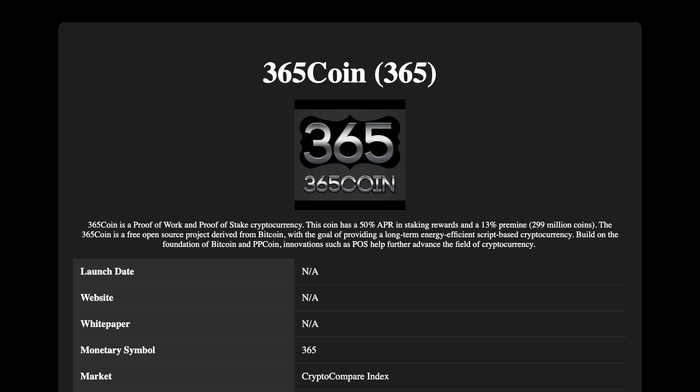
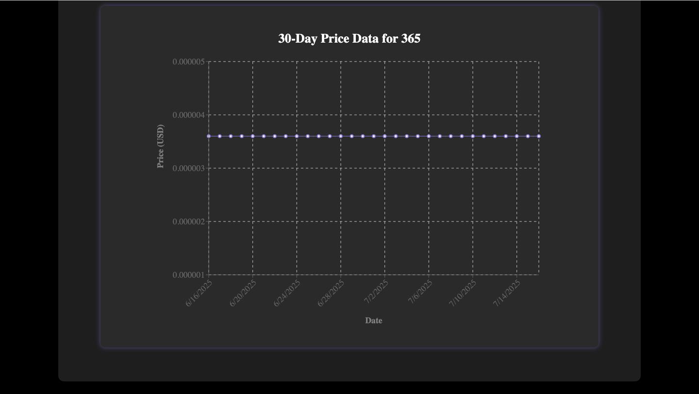

# Web Development Lab 6 - *Crypto Hustle Pro*

Submitted by: **Kelly Chan**

This web app: **CryptoHustle Pro will extend your CryptoHustle Lite web app. In this upgraded version, you will make additional API calls to create a detail view for each currency. The CryptoCompare API supports adding a description, price history, related news articles and more for each currency. You will use React Router to create dynamic URLs for the app.**

Time spent: **30** mins spent in total

## Required Features

The following **required** functionality is completed:

- [X] Clicking on a currency in the list displays more information about it, such as its description, algorithm type, and price history
- [X] Each currency has a direct, unique link to its own page

The following **optional** features are implemented:

- [X] The site displays a graph of a currency’s change in price over time

## Image

Here's images of implemented required features:

 
 

## License

    Copyright 2025 Kelly Chan

    Licensed under the Apache License, Version 2.0 (the "License");
    you may not use this file except in compliance with the License.
    You may obtain a copy of the License at

        http://www.apache.org/licenses/LICENSE-2.0

    Unless required by applicable law or agreed to in writing, software
    distributed under the License is distributed on an "AS IS" BASIS,
    WITHOUT WARRANTIES OR CONDITIONS OF ANY KIND, either express or implied.
    See the License for the specific language governing permissions and
    limitations under the License.